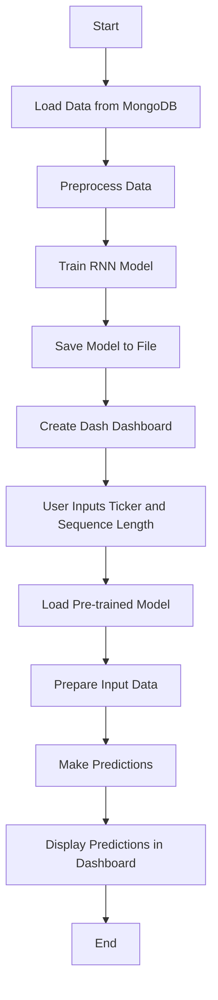

Explanation:
Start: The process begins.
Load Data from MongoDB: Data is loaded from MongoDB into a Spark DataFrame and then converted to a Pandas DataFrame.
Preprocess Data: The data is preprocessed, including normalization and sequence creation.
Train RNN Model: An RNN model is trained using the preprocessed data.
Save Model to File: The trained model is saved to a file for later use.
Create Dash Dashboard: A Dash dashboard is created to allow user interaction.
User Inputs Ticker and Sequence Length: The user inputs the ticker symbol and sequence length in the dashboard.
Load Pre-trained Model: The pre-trained model for the specified ticker is loaded from the file.
Prepare Input Data: The input data is prepared based on the user-specified sequence length.
Make Predictions: The model makes predictions based on the prepared input data.
Display Predictions in Dashboard: The predictions are displayed in the Dash dashboard.
End: The process ends.
