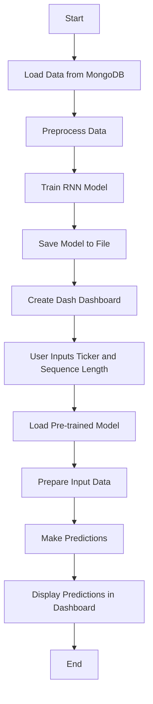

Explanation:
Start: The process begins.
Load Data from MongoDB: Data is loaded from MongoDB into a Spark DataFrame and then converted to a Pandas DataFrame.
Preprocess Data: The data is preprocessed, including normalization and sequence creation.
Train RNN Model: An RNN model is trained using the preprocessed data.
Save Model to File: The trained model is saved to a file for later use.
Create Dash Dashboard: A Dash dashboard is created to allow user interaction.
User Inputs Ticker and Sequence Length: The user inputs the ticker symbol and sequence length in the dashboard.
Load Pre-trained Model: The pre-trained model for the specified ticker is loaded from the file.
Prepare Input Data: The input data is prepared based on the user-specified sequence length.
Make Predictions: The model makes predictions based on the prepared input data.
Display Predictions in Dashboard: The predictions are displayed in the Dash dashboard.
End: The process ends.
End: The process ends.

MongoDB:
`brew services start mongodb-community@8.0`


Benchmarking:
Sure, let's create a Python script using the Yahoo! Cloud Serving Benchmark (YCSB) to connect to your MongoDB instance and measure read time. YCSB is a popular benchmarking tool for evaluating the performance of various databases.

### Step-by-Step Guide

1. **Install the Required Libraries**:
   - `pymongo`
   - `ycsb`

2. **Set Up the YCSB Workload**:
   - Define the workload for measuring read time.

3. **Run the Benchmark**:
   - Connect to MongoDB and execute the workload.

### Step 1: Install the Required Libraries

You can install `pymongo` using `pip`:

```sh
pip install pymongo
```

### Step 2: Set Up the YCSB Workload

YCSB typically uses a workload file to define the operations to be performed. For simplicity, we'll define the workload directly in the script.

### Step 3: Run the Benchmark

Here's the code for 

benchmarking.py

:

```python
import pymongo
import time
import random

# MongoDB connection details
MONGO_URI = "mongodb://localhost:27017/"
DATABASE_NAME = "stocks"
COLLECTION_NAME = "PROCESSED_DB"

# Number of reads to perform
NUM_READS = 1000

def connect_to_mongo():
    client = pymongo.MongoClient(MONGO_URI)
    db = client[DATABASE_NAME]
    collection = db[COLLECTION_NAME]
    return collection

def measure_read_time(collection):
    total_time = 0
    for _ in range(NUM_READS):
        # Generate a random query (adjust based on your data schema)
        query = {"ticker": random.choice(["TSLA", "AAPL", "GOOG", "AMZN", "MSFT"])}
        
        start_time = time.time()
        result = collection.find_one(query)
        end_time = time.time()
        
        if result:
            total_time += (end_time - start_time)
    
    avg_read_time = total_time / NUM_READS
    return avg_read_time

def main():
    collection = connect_to_mongo()
    avg_read_time = measure_read_time(collection)
    print(f"Average read time for {NUM_READS} reads: {avg_read_time:.6f} seconds")

if __name__ == "__main__":
    main()
```

### Explanation:

1. **Connect to MongoDB**:
   - The `connect_to_mongo` function establishes a connection to the MongoDB instance and returns the collection object.

2. **Measure Read Time**:
   - The `measure_read_time` function performs a specified number of read operations (`NUM_READS`) and measures the time taken for each read.
   - It generates random queries based on the `ticker` field (adjust this based on your data schema).
   - It calculates the average read time.

3. **Main Function**:
   - The `main` function connects to MongoDB, measures the read time, and prints the average read time.

### Running the Script

Save the code to 

benchmarking.py

 and run it using the following command:

```sh
python benchmarking.py
```

This script will connect to your MongoDB instance, perform the specified number of read operations, and print the average read time. Adjust the `MONGO_URI`, `DATABASE_NAME`, `COLLECTION_NAME`, and query parameters as needed based on your MongoDB setup and data schema.